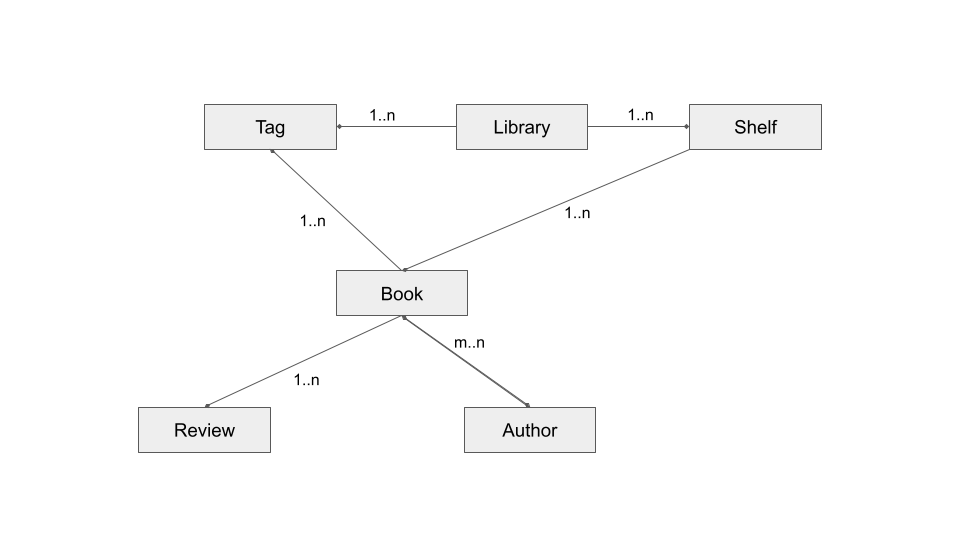

### 1. Library Entity Relation Diagram:

### 2. REST:

The REST Api documentation is based on **Open Api Specification (OAS) 3.0** 
The documentation is available at the following endpoints:

- **swagger-ui: **`server-host:9006/swagger-ui.html`  [when property `server-port=9006`  is opened in *application.properties*]
- **json: **`server-host:9006/v3/api-doc`
- **yaml: ** `server-host:9006/v3/api-doc.yaml`

### 3. Server:

The application is deployed in **JBoss EAP 7.3.0** server on port `8080`. The admin console is available on port `9990`.

- **application url:** `server-host:8080/bibliotheek`
- **admin console:** `server-host:9990/console/index.html`

